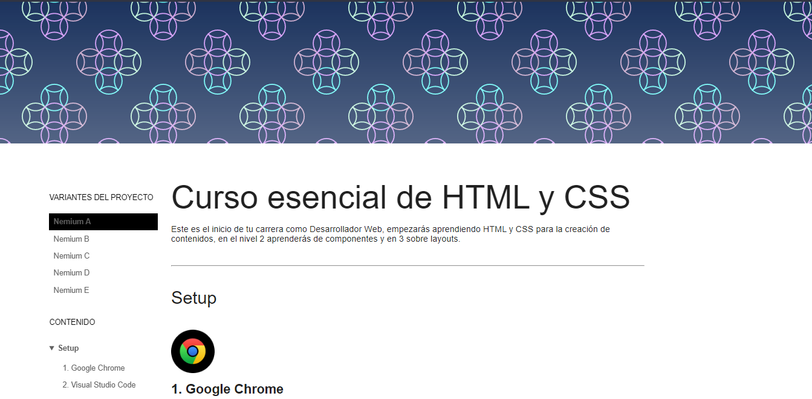
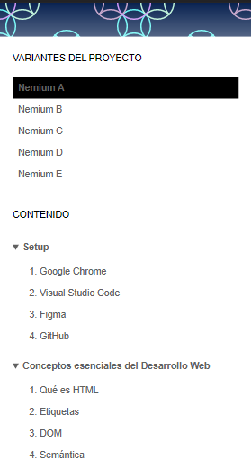

# nemium-blog

Project Nemium-Blog, implemented from a design in Figma [course essential of HTML and CSS](https://leonidasesteban.com/aprender/html-css-fundamentos).

## Desktop

## Mobile

### Features

- DOM, Navigation
- Mobile responsive

### Links
- [Website](https://estebanpajares.github.io/nemium-blog/)
- [Figma](https://www.figma.com/file/ibCULPDvX3Ki2QvNrKshA4/Nemium?node-id=59%3A2)
- [Project Nemium](https://leonidasesteban.com/proyectos/nemium)

## Technologies

- HTML
- CSS
- JavaScript
- Responsive Design
